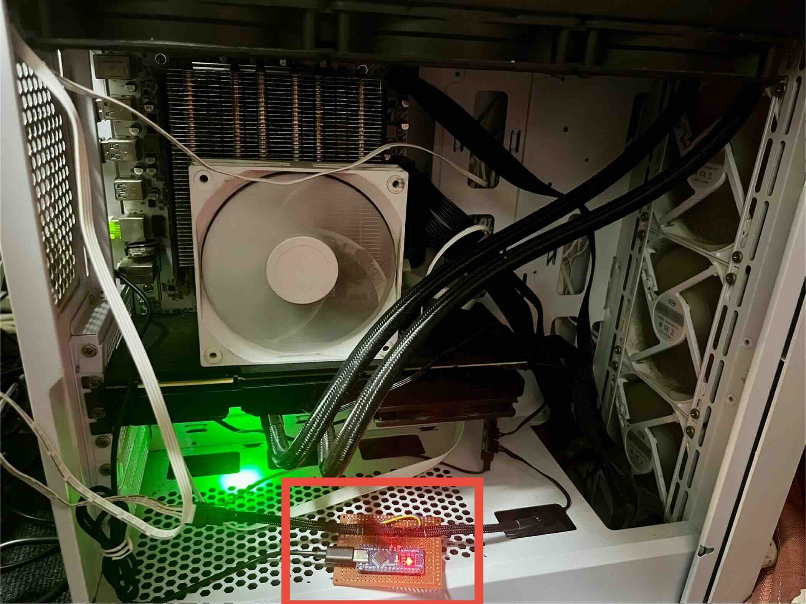

# Arduino PWM Fan Control System

An intelligent PWM fan control system based on Arduino, featuring real-time RPM monitoring and GPU temperature-adaptive speed adjustment.

## Core Features

### Arduino Hardware Controller
- **Precise PWM Control**: 0-255 speed levels, supports 4-wire PWM fans
- **Real-time RPM Monitoring**: Hardware interrupt-driven tachometer detection
- **Data Validation**: CRC8 checksum ensures reliable serial communication
- **Power-off Memory**: EEPROM saves speed settings, automatically restores after power loss
- **Watchdog Protection**: Prevents system crashes, automatic recovery

### Go Software Controller
- **GPU Temperature Adaptive**: Automatically adjusts fan speed based on NVIDIA GPU temperature
- **Flexible Configuration**: YAML config file for custom temperature curves
- **Multiple Modes**: Auto mode, manual mode, read-only mode, test mode


## Hardware Connection

- **Arduino Nano** (ATmega328P)
- **4-wire PWM Fan**
- **Pin Configuration**:
  - Pin 3: Fan TACH signal (interrupt input)
  - Pin 5: PWM output


## Quick Start

### Configuration File Example

```yaml
fan_level:
  - temp: 20
    fan: 50
  - temp: 30
    fan: 150
  - temp: 35
    fan: 255
    
serial_port: /dev/ttyUSB0
```

## Usage Examples

```bash
# Manually set fan speed
./gpu_fan_auto_control -fan 150

# Read current speed
./gpu_fan_auto_control -readonly

# Automatic temperature control
./gpu_fan_auto_control

# Test mode (doesn't actually change speed)
./gpu_fan_auto_control -dryrun
```

## Communication Protocol

```
Request:  fanpwm:<speed>:<sequence>:<CRC8>
Response: fanpwm:<RPM>:<speed>
```

## Future Improvements

- [ ] Fix RPM detection
- [ ] Real-time RPM logging to PC


## Why This Project?

My GPU is a heavily modified GTX2080Ti 22GB, equipped with a dedicated water cooling system and three huge fans. These fans are not controlled by the motherboard, so by default, they always run at full speed which is extremely noisy. I wanted a software solution that could automatically and intelligently control the fan speed for improved comfort and flexibility.


