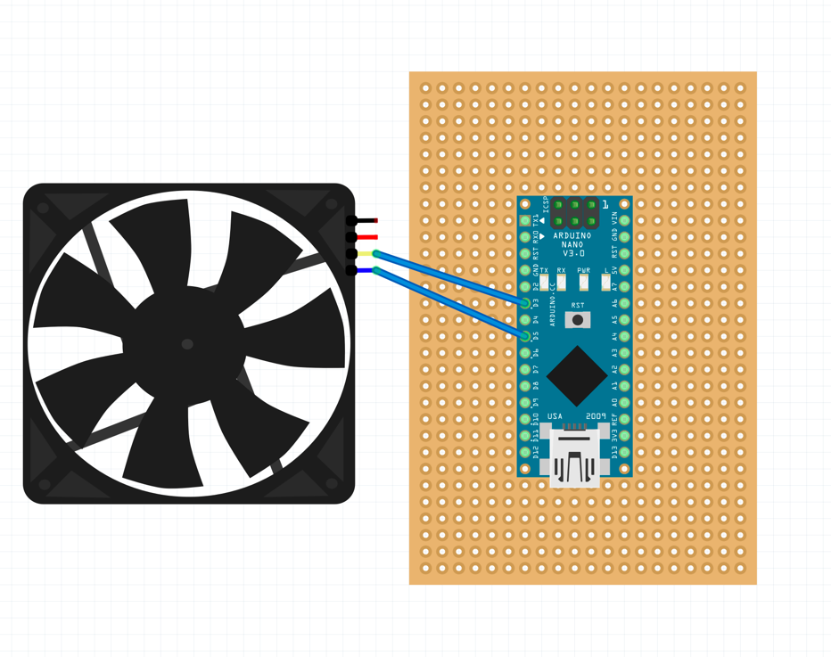

# Arduino PWM 风扇控制系统

一个基于 Arduino 的智能 PWM 风扇控制系统，支持实时 RPM 监控和 GPU 温度自适应调速。

## 核心功能

### Arduino 硬件控制器
- **精确 PWM 控制**：0-255 级速度调节，支持 4 线 PWM 风扇
- **实时 RPM 监控**：硬件中断驱动的转速检测
- **数据校验**：CRC8 校验确保串口通信可靠性
- **断电记忆**：EEPROM 保存速度设置，断电后自动恢复
- **看门狗保护**：防止系统死机，自动恢复

### Go 软件控制器
- **GPU 温度自适应**：根据 NVIDIA GPU 温度自动调节风扇速度
- **灵活配置**：YAML 配置文件自定义温度曲线
- **多种模式**：自动模式、手动模式、只读模式、测试模式

## 技术亮点

1. **工业级可靠性**
   - CRC 校验保证数据传输准确
   - 看门狗定时器防止死机
   - EEPROM 持久化存储

2. **实时反馈**
   - 读取风扇实际 RPM 值
   - 可检测风扇故障
   - 双向通信协议

3. **硬件中断设计**
   - 使用硬件中断精确计数转速脉冲
   - 高负载下仍能准确测量

4. **智能温度曲线**
   - 根据 GPU 温度自动查找最优风扇速度
   - 平滑的温度区间过渡

## 硬件连接

- **Arduino Nano** (ATmega328P)
- **4 线 PWM 风扇**
- **引脚配置**：
  - Pin 3: 风扇 TACH 信号（中断输入）
  - Pin 5: PWM 输出



## 快速开始

### 配置文件示例

```yaml
fan_level:
  - temp: 20
    fan: 50
  - temp: 30
    fan: 150
  - temp: 35
    fan: 255
    
serial_port: /dev/ttyUSB0
```

## 使用示例

```bash
# 手动设置风扇速度
./gpu_fan_auto_control -fan 150

# 读取当前速度
./gpu_fan_auto_control -readonly

# 自动温度控制
./gpu_fan_auto_control

# 测试模式（不实际改变速度）
./gpu_fan_auto_control -dryrun
```

## 通信协议

```
请求: fanpwm:<速度>:<序号>:<CRC8>
响应: fanpwm:<RPM>:<速度>
```


📈 Future Improvements
[ ] Fix RPM 检测
[ ] 实时记录RPM到PC